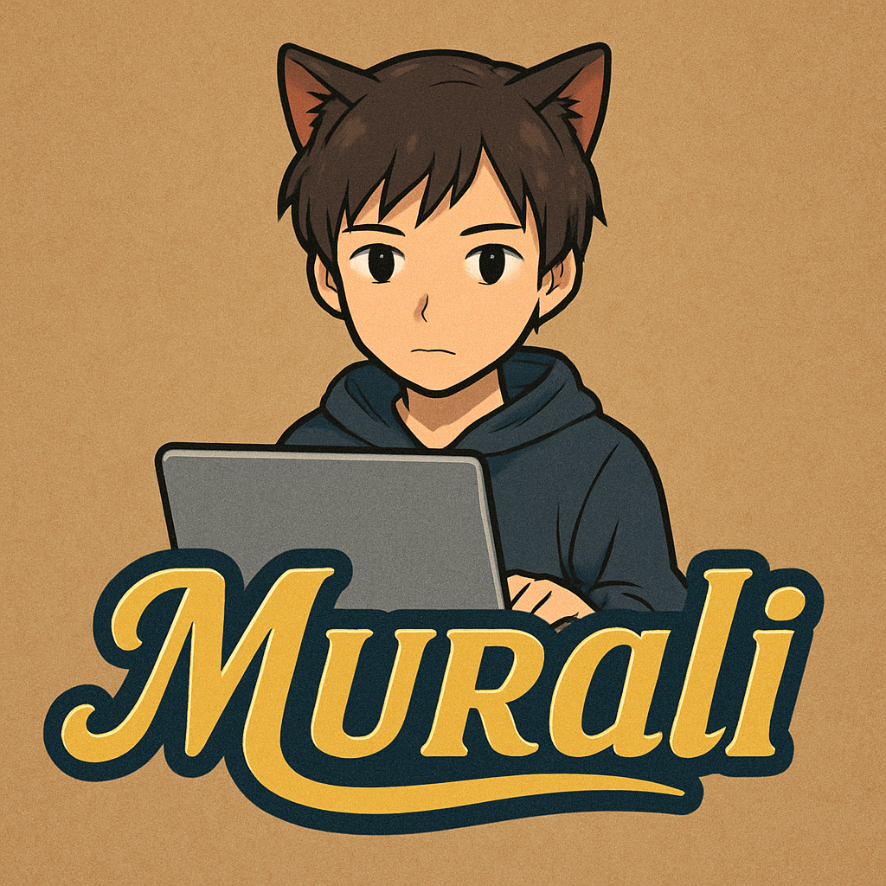

 
    

 

  

---

  

---

## 🔥 **Greetings, Digital Wanderer!**

Hey There! 👋 I'm **Murali**, a Passionate Explorer In The Realm Of Code And Creativity!  
While I May Not Be A Coding Wizard Just Yet 😅, My **Curiosity Knows No Bounds!**  
Every Line Of Code I Write Brings Me One Step Closer To Mastery, And This Space Is Where My Journey Unfolds! 🚀  

---

## 🌱 **Growing, Learning, And Innovating**

🔹 **Passion Fuels My Progress!** I Believe In Learning Something New Every Single Day!  
🔹 **Every Challenge Is A Lesson!** Whether It’s Debugging A Tricky Error Or Experimenting With New Tech, I Embrace It All!  

### 💡 **What’s Brewing In My Mind?**  
✨ Web Development – Crafting Beautiful Digital Experiences With **HTML, CSS, & JavaScript**  
✨ APIs & Integrations – Connecting The Dots Between Systems Seamlessly  
✨ Open-Source Contributions – Giving Back To The Amazing Developer Community  

---

## 🧰 **My Tech Toolbox**

Here are some of the tools and technologies I use and love:

---

## 🚀 **Explore My Creations!**

Feel Free To Dive Into My Work, Share Your Thoughts, And Let’s Build Something Amazing Together!  
Whether You’re Here To Get Inspired, Collaborate, Or Just Say Hi, You’re Always Welcome! 😃  

  

---

## 🤝 **Let’s Connect!**

> _Got an idea, a collab, or just want to chat? I’d love to hear from you!_

  
  
  
  

---

## 🎨 **Crafted With Passion, Pixels, And Endless Curiosity!**  

✨ **Stay Curious, Keep Coding!** ✨
